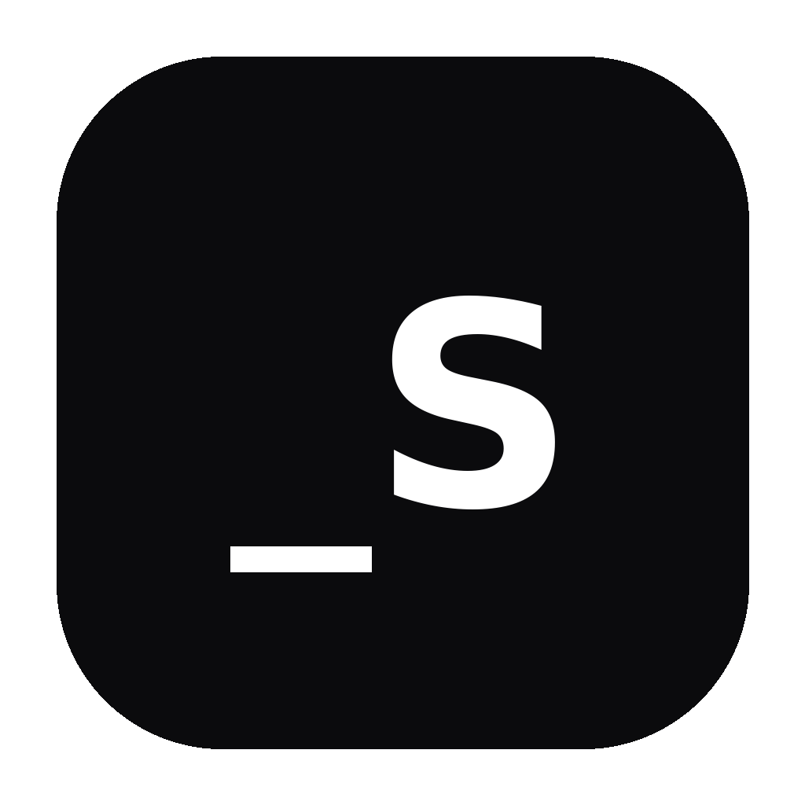

<div align="center">
  
</div>

# `_davSPACE`

Analizzatore locale dello spazio su disco per Windows, macOS e Linux.  
Local disk space analyzer for Windows, macOS and Linux.

**v1.0.2 · Local-first · No telemetry**

Interfaccia allineata al design system di `_davMEDIA` e della suite `_davstudios`.

## Italiano

`_davSPACE` analizza una cartella o un disco senza modificare i file e senza inviare dati online.

### v1.0.2

Patch di release senza modifiche funzionali, preparata per un nuovo ciclo pulito di commit/tag/release.

- Versione sincronizzata a 1.0.2 tra package npm, Tauri e Cargo.
- Aggiornati metadata, test e launcher alla nuova patch.
- Nessuna modifica al motore di scansione o all’interfaccia.

### v1.0.1

Patch di affidabilità per build e CI multipiattaforma.

- Launcher Windows riallineato al flusso verificato della suite.
- Configurazione Vite resa coerente con il contratto Tauri usato nei test.
- Metadata e test di release aggiornati alla versione 1.0.1.

### v1.0.0

- Scansione ricorsiva di cartelle e dischi.
- Link simbolici non seguiti.
- Annullamento della scansione con risultati parziali.
- Totale spazio, file, cartelle ed elementi non accessibili.
- Cartelle ordinate per dimensione ricorsiva.
- File ordinati per dimensione con ricerca, categoria e soglia minima.
- Categorie Video, Immagini, Audio, Archivi, Documenti, Codice e Altro.
- Paginazione senza limite artificiale al numero di file scansionati.
- Apertura della posizione di file e cartelle.
- Drag & drop di una cartella o disco.
- Esclusione opzionale di nomi cartella.
- Tema chiaro/scuro e Italiano/English.
- Versione UI letta automaticamente da Tauri.
- Elaborazione interamente locale.

### Avvio su Windows

`RUN-WINDOWS.bat`

Oppure:

```bash
npm install
npm run desktop
```

La release corrente è `v1.0.2`, patch della prima versione stabile `v1.0.0`.

## English

`_davSPACE` analyzes a folder or drive without modifying files or uploading data.

### v1.0.2

Release-only patch with no functional changes, prepared for a clean new commit/tag/release cycle.

- Version synchronized to 1.0.2 across npm package, Tauri and Cargo.
- Metadata, tests and launcher updated to the new patch version.
- No changes to the scan engine or user interface.

### v1.0.1

Reliability patch for cross-platform build and CI.

- Windows launcher aligned with the suite's verified flow.
- Vite configuration aligned with the Tauri contract used by tests.
- Release metadata and tests updated to version 1.0.1.

### v1.0.0

- Recursive folder and drive scanning.
- Symbolic links are not followed.
- Scan cancellation with partial results.
- Total space, files, folders and inaccessible items.
- Folders sorted by recursive size.
- Files sorted by size with search, category and minimum-size filters.
- Video, Images, Audio, Archives, Documents, Code and Other categories.
- Pagination with no artificial limit on scanned file count.
- Reveal files and folders in the system file manager.
- Folder or drive drag and drop.
- Optional folder-name exclusions.
- Light/dark theme and Italiano/English.
- UI version read automatically from Tauri.
- Fully local processing.

### Windows launch

`RUN-WINDOWS.bat`

Or:

```bash
npm install
npm run desktop
```

The current release is `v1.0.2`, a patch to the first stable `v1.0.0` release.

## Support _davstudios

Website: https://www.davstudios.it  
Buy Me A Coffee: https://buymeacoffee.com/davstudios

## License

MIT
